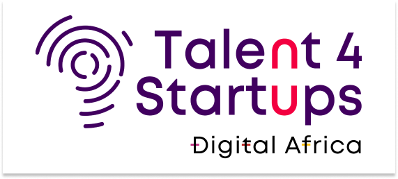

<h1 align = "center">AUTOMATISATION DU PROCESSUS D’OCTROI DE PRÊT D’UNE STRUCTURE DE MICROFINANCE</h1>
<h3 align = "center">Fait par CODECRAFTERS - GROUPE N</h3>

  
  

## OBJECTIF
L'objectif principal du projet est d'améliorer l'efficacité opérationnelle de l'institution de microfinance, de réduire les risques liés aux prêts et d'offrir une meilleure expérience client, tout en contribuant à l'inclusion financière des populations mal desservies.

Le projet vise à mettre en place un système de gestion de prêt bancaire pour une institution de microfinance afin d'automatiser et de rationaliser le processus de prêt, tout en garantissant une gestion efficace des fonds et une expérience client améliorée.

## LE DÉFI:
Comment pouvons-nous simplifier le processus de demande de prêt pour les clients et le staff de la structure de microfinance, tout en assurant une évaluation précise de la solvabilité des demandeurs?

## NOTRE SOLUTION:
système d'information (site web) en intégrant une IA afin d'accélérer et d'automatiser le processus d'octroi de prêt tout en réduisant les risques de défaut de paiement.

